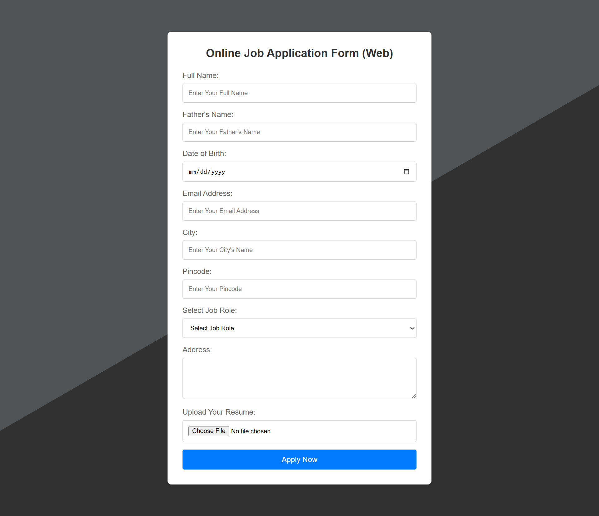
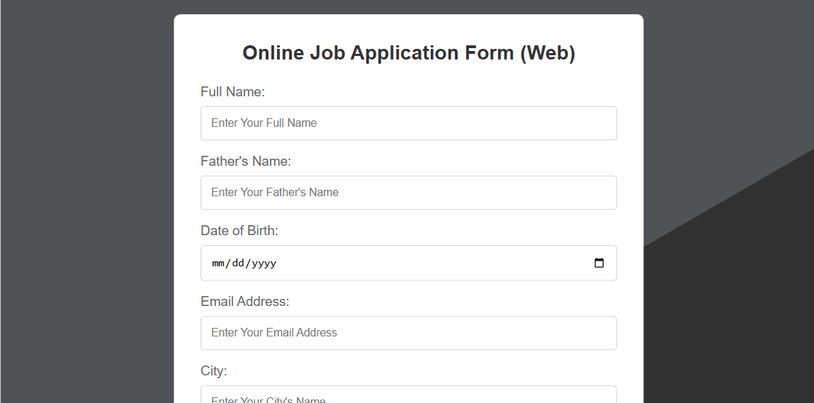
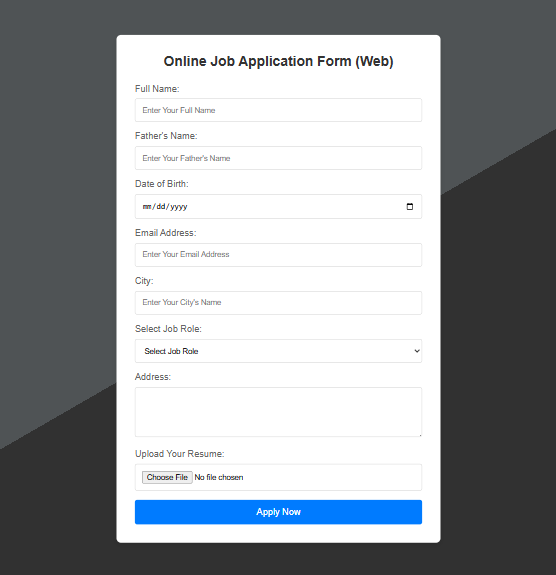
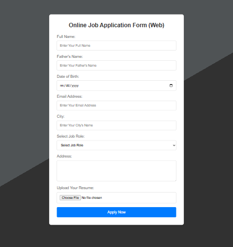

# Online Job Application Form (Web) 📄

A modern, clean, and fully responsive job application form built using HTML5 and CSS3. This project focuses on providing a seamless user experience across different devices while maintaining a high standard of design and responsiveness.

## ✨ Features
- **Modern UI:** Features a minimalist design with soft shadows and professional typography.
- **Fully Responsive:** Specifically optimized for Mobile, Tablet, and Desktop screen resolutions.
- **Advanced Form Elements:** Includes styled input fields, a date picker, custom dropdowns, file upload functionality, and an interactive "Apply Now" button.
- **Clean Codebase:** Built using semantic HTML5 tags and organized CSS3 for better maintainability.

## 📱 Responsiveness Showcase

### Desktop View

### Tablet (768px) & Mobile (375px/320px)
<table>
  <tr>
    <td><b>Tablet View (768px)</b></td>
    <td><b>Mobile Medium (375px)</b></td>
    <td><b>Mobile Small (320px)</b></td>
  </tr>
  <tr>
    <td></td>
    <td></td>
    <td></td>
  </tr>
</table>

## 🛠️ Tech Stack
- **HTML5:** Used for semantic structure and form architecture.
- **CSS3:** Used for custom styling, layout positioning, and Media Queries to handle responsiveness.

## 🚀 Live Demo
[Insert your Vercel deployment link here]
